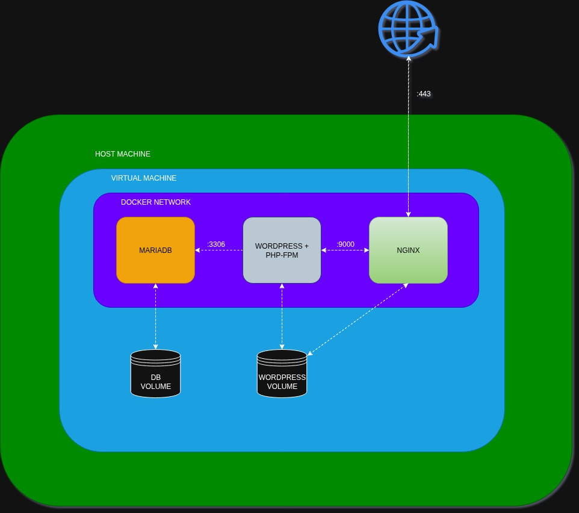

*This project has been created as part of the 42 curriculum by odruke-s.*

# Inception

## Description
This project builds a small, self-contained web infrastructure using Docker. The stack provides a WordPress site served over HTTPS by Nginx, backed by a MariaDB database, and orchestrated with Docker Compose. The goal is to practice containerization, service isolation, networking, persistence, and basic automation.

## Architecture


## Project Structure
```
.
├─ Makefile
├─ README.md
├─ docs/
│  └─ imgs/
├─ secrets/
│  ├─ credentials.txt
│  ├─ db_password.txt
│  └─ db_root_password.txt
└─ srcs/
  ├─ docker-compose.yml
  ├─ requirements/
  │  ├─ mariadb/
  │  │  ├─ Dockerfile
  │  │  └─ tools/
  │  │     └─ init.sh
  │  ├─ nginx/
  │  │  ├─ Dockerfile
  │  │  ├─ conf/
  │  │  │  └─ default.template
  │  │  └─ tools/
  │  │     └─ entrypoint.sh
  │  └─ wordpress/
  │     ├─ Dockerfile
  │     ├─ conf/
  │     │  └─ www.conf
  │     └─ tools/
  │        └─ init.sh
  └─ tools/
    └─ ssl.sh
```

## Project Description and Design Choices
- Docker is used to isolate each service into its own container, making the stack reproducible and easy to rebuild from Dockerfiles.
- Included sources are the Dockerfiles, the Compose file, Nginx configuration, PHP-FPM pool configuration, initialization scripts for MariaDB and WordPress, and a script to generate a self-signed SSL certificate.
- Design choices:
  - Only Nginx is exposed to the host on port 443; the database and PHP-FPM are kept internal.
  - A dedicated bridge network enables container-to-container DNS resolution by service name.
  - Persistent data is stored on the host via bind-mounted volumes so container rebuilds do not lose content or database data.
  - Secrets are stored in files and injected into containers via a generated .env file to keep sensitive values out of the Compose file.

### Comparisons
- Virtual Machines vs Docker: VMs include a full guest OS and are heavier to start and run; Docker containers share the host kernel, start faster, and use fewer resources, which is ideal for small service stacks.
- Secrets vs Environment Variables: Secrets in files avoid hardcoding sensitive data in Compose or images. This project reads secret files to generate a .env file, which is then passed to containers; it keeps values centralized and avoids committing them. While secrets are in fact a docker swarm feature, we can use that philosophy and perform a similar approach.
- Docker Network vs Host Network: A bridge network isolates containers and provides service-name DNS, reducing host exposure. Host networking removes isolation and can cause port conflicts; this project uses a bridge network.
- Docker Volumes vs Bind Mounts: Volumes are managed by Docker, while bind mounts map explicit host paths. Here, named volumes are configured as bind mounts to fixed host directories for predictable persistence.

## Instructions
### Prerequisites
- Docker and Docker Compose
- GNU Make
- OpenSSL (the build script installs it if missing)

### Configure secrets
Create these files under secrets/:
- credentials.txt with lines:
  - DOMAIN_NAME <your_domain>
  - USER <your_wp_user>
  - ROOT <your_db_root_user>
  - USER_EMAIL <your_email>
- db_password.txt with the WordPress database user password
- db_root_password.txt with the MariaDB root password

### Hostname
Map the domain to localhost in /etc/hosts:
- 127.0.0.1 <your-domain> (use DOMAIN_NAME from credentials.txt)

### Build and run
- make build
- Open https://<your-domain> (accept the self-signed certificate warning)

### Useful commands
- make up: start containers (no rebuild)
- make stop: stop containers
- make down: stop and remove containers
- make status: show container status
- make logs: show recent nginx logs
- make ssl: generate SSL certificates if missing
- make clean: stop containers, remove srcs/.env and SSL certs, prune Docker artifacts
- make re: full cleanup and rebuild

## Documentation
- [USER_DOC.md](USER_DOC.md): User and admin guide
- [DEV_DOC.md](DEV_DOC.md): Developer setup and operations

## Resources
- Docker documentation: https://docs.docker.com/
- Docker Compose documentation: https://docs.docker.com/compose/
- Nginx documentation: https://nginx.org/en/docs/
- WordPress documentation: https://wordpress.org/documentation/
- WP-CLI documentation: https://developer.wordpress.org/cli/commands/
- MariaDB documentation: https://mariadb.com/kb/en/documentation/
- PHP-FPM documentation: https://www.php.net/manual/en/install.fpm.php

AI usage:
- Used as support alongside official documentation to understand concepts, to find commands or keywords faster, and to help structuring documentation.
